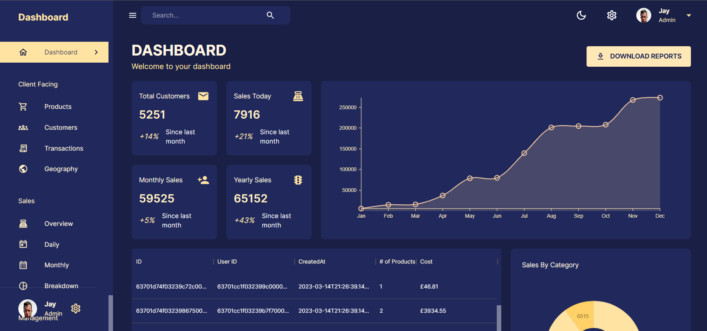

# MERN-Dashboard
MERN React Admin Dashboard

This is a web application built with the MERN (MongoDB, Express, React, Node.js) stack. 
It is an admin dashboard that allows users to view and manage data in a MongoDB database.

## Installation
To run this application, you will need to have Node.js and MongoDB installed on your machine.

Clone this repository to your local machine.
Navigate to the root directory of the project in your terminal.
From here you will need to use the terminal to open the server and client folders separately.
Run npm install to install the necessary dependencies (this will need to be done in both server and client folders).
Run npm run dev to start the application in the server folder which will then load up in port 5001.
Then navigate to the client folder and run npm run start, this will then load in your window or you can manually open your web browser and 
go to http://localhost:3000 to view the application.

## Usage
Once the application is running, you can use the dashboard to view and manage data in the MongoDB database. The dashboard includes features such as:

Viewing data in a table or chart format
Adding new data to the database
Editing existing data
Deleting data from the database
The application includes a login system that requires users to sign in with a username and password. 
The login credentials are stored in the MongoDB database (This will need to be adapted).

## Technologies Used
This application uses the following technologies:

MongoDB - a NoSQL database used for storing data
Express - a web application framework for Node.js used for building the backend API
React - a JavaScript library used for building the frontend UI
Node.js - a JavaScript runtime used for building the backend API
Bootstrap - a CSS framework used for styling the UI
Contributing
This is an open-source project and contributions are welcome. If you would like to contribute to this project, please fork the repository and 
submit a pull request with your changes.

License
This project is licensed under the MIT License - see the LICENSE file for details.

### Link to live site
[Jays-Dashboard](https://jays-dashboard.onrender.com)
Please remember this will take some time to load due to the site going dormant after 15mins of no activity 😊
